# [fit] Hacking
# [fit] Culture
# [fit] _**With Javascript**_

^ Hello

---

# Ben Straub

## * benstraub*


^ My name is Ben Straub.

---


^ I've worked on a lot of things in my career, from device drivers to desktop applications to books

---


---


---

# [fit] automation

^ but probably the most fascinating thing I've worked on is automation for my team. And the most interesting part of that _isn't_ the REST API for the chat service, it's the human part. I like to call this

---

# [fit] cultural
# [fit] automation

^ **cultural automation**, which I think is a term I made up as I was writing this talk. When I say "cultural automation", what I mean is the use of machines to assist with and amplify social interactions. That sounds academic and useless, but there's a 99% chance everyone is this room has used it.

---

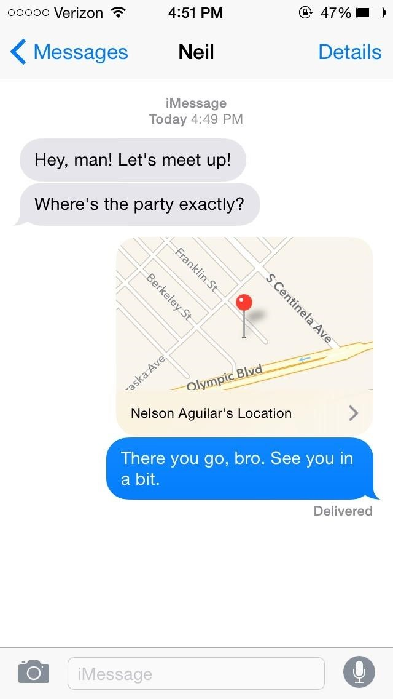


^ I'm old enough to remember that buying a cell phone with a camera on it seemed like a dumb idea, but in hindsight it's obvious that we would use more than just calling and text messaging to communicate. This is a bigger deal than it seems – for most of human history, we've only been able to use our voices and bodies to talk to each other. Not that long ago, we added plain text, starting with Email and IRC, and then SMS. Adding imagery into the mix has only really happened in the last 6 or so years for most people, and as a medium it's very powerful.

^ The reason you know it's powerful is that a given person can be good or bad at it, there's skill involved. And I've known some people who are _really_ good at this. One person I know took some time off between jobs, and when he was asked in a chat room what he did with himself during his months-long absence, he replied only with a photo.

---


[.footer: https://www.flickr.com/photos/jackal1/15066929313]

^ And nothing else. He didn't use a single word, but he conveyed more with that one image than he could have by spending all day typing into a little text box. Kyle used this image the way a poet uses words.

^ Steve Jobs used to tell this anecdote about bicycles. If you haven't heard it, I'll tell it to you now, and if you **have** heard it, I apologize in advance for telling it poorly.

---


^ In the 70s, there was a study on how efficient different species were at travelling distances, how much energy it took for each kind of animal to get itself from one place to another. On this chart the most efficient measurements are toward the bottom, with salmon and horses leading the animal kingdom, and humans a little behind them. Then someone thought to measure different transportation technologies on the same scale, and the cars and airplanes of the time ranked somewhere in the middle. But the measurement for a human on a bicycle was **way** ahead of the pack, 3 times more efficient than the salmon or the horse.

^ Steve used to say that the computer was a _bicycle for your mind_. It gives you this amazing lever that allows your mind to do far more than it could without it. I like to think that cultural automation is a _bicycle for your voice._ It's not that these tools let us do more of the same kind of thing, they allow us to do things that weren't even thinkable without them.

---

# [fit] Automation
# [fit] Is _**good**_

^ So that's a super rosy view of automation. As engineers and developers, we usually take it as an axiom that automation is a good thing. With a few exceptions we've been mostly right, and the world is a much different, and some would say much better place now than it was 10 or 20 years ago because of automation.

---

# [fit] Automation
# [fit] is _**Dumb**_

^ But we also know, as engineers and developers, that computers are _really_ stupid.

---

> A computer lets you make more mistakes faster than any invention in human history
-- Mitch Ratcliffe

^ I don't have to tell anyone in this room how pedantic they are about what you tell them to do. What we've learned from a couple thousand years of making machines, and 50 years of writing code, is that we have to be careful where we point these things.

---

# [fit] Cultural
# [fit] Automation
# [fit] Is good_**?**_

^ So when we talk about automating culture, a certain amount of caution is in order. We need to make sure we're paying attention to the outcomes, and learn lessons from our mistakes.

^ The best mistakes to learn from are _other people's_ mistakes, so now I'm have a few stories to share with you.

---


^ The first one is from when I used to work at GitHub. When I joined I was astonished how different that place was from other companies. I learned in university that making software as a team is more of a social problem than a technical one, but this was a place that took such a different and refreshing tack on that truth than anywhere else I've worked before or since. One of the biggest factors in this is that GitHub was a remote-first workplace; none of the processes there assume you're physically in the office. In practical terms, that means pretty much all communication takes place in the chat room.

---

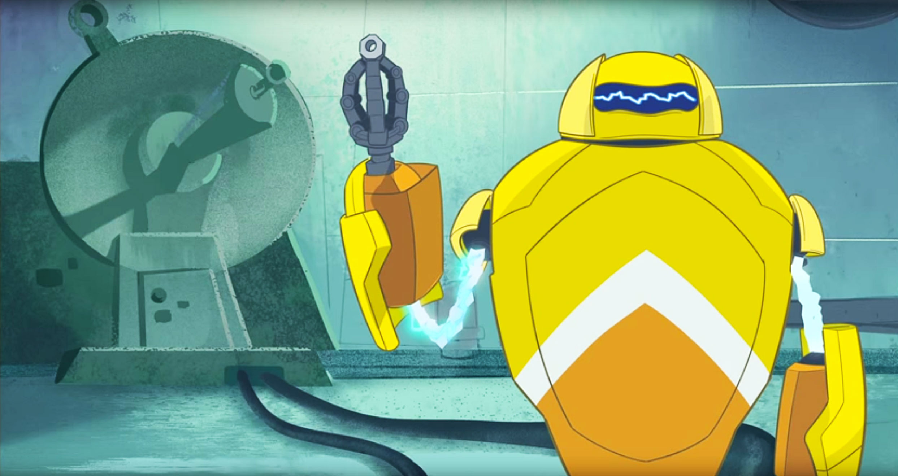

^ And early on, that chat room started to be automated. This is Hubot, the bot that lives in GitHub's chat system. From what I can piece together, he started out as kind of a half-joke, filling the channel with gifs and photos of pugs, but at some point someone taught him how to unlock the front door of the office, and it was all downhill from there.

---

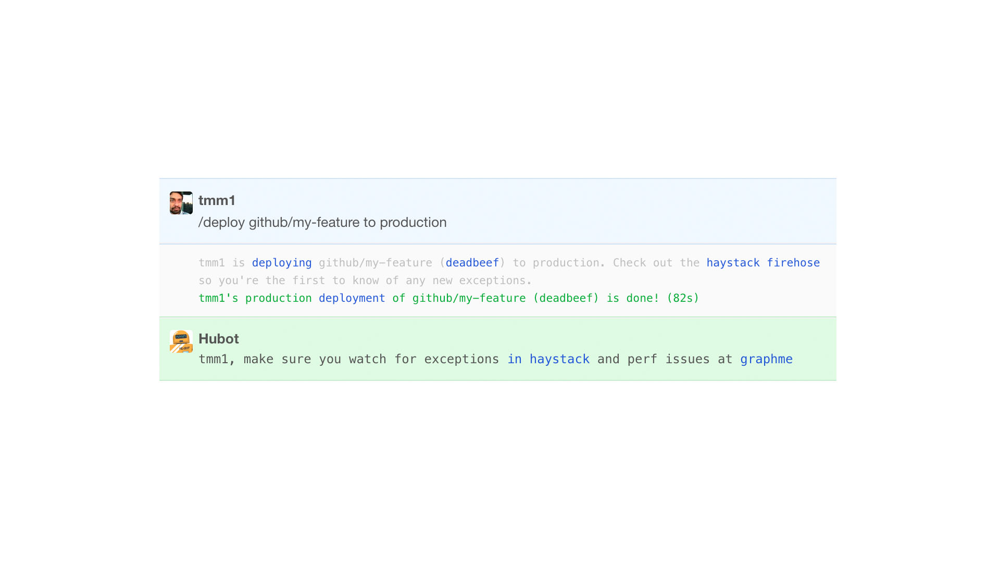

^ If you've heard about Hubot before, you've probably heard about how he does deployment. GitHub deploys to production hundreds of times every week, and the only UI for deploying is the chat room - you just tell Hubot to go do it.

^ This is a little bit interesting on a technical level, but most of the nuance here is social. The chat room becomes an information radiator, you can always look at it and see what the rest of your team is up to. When a deploy goes badly, you don't have to shout for help and explain what's happening, everyone already knows, because they were there when it happened. You have **situational awareness**.

---


^ Another great example is metrics. Gathering metrics and displaying graphs and dashboards is probably something we've all done, but doing it in a browser window and doing it in a chat room are fundamentally different.

^ When you put up a graph in the chat room, you're saying to the rest of the team "everybody look at this, there's something important I want you to see." It's less like digging through metrics, and more like putting something on the big screen at the front of mission control.

---


^ This has the benefit that everybody can see what the most experienced engineer on the team is doing. What kinds of metrics do they pay attention to? How does that person go about finding a problem? Hubot turns the chat room into the place where you're pairing with everyone on your team all of the time. One subtle advantage this confers is with onboarding: you see all of this happening _on your first day_.

---

# [fit] Chat_**Ops**_

^ Jesse Newland at GitHub coined the term "ChatOps" to describe this kind of automation. There are drawbacks to this approach as well, the most obvious one is noise. When your whole product team is 5 or maybe 10 people, the amount of content scrolling by in the chat room is manageable, but with a team of 50 it's almost unbearable. You're probably deploying and monitoring 10 independent projects, so you move some of them into separate rooms, and pretty soon your Slack looks like this.

---

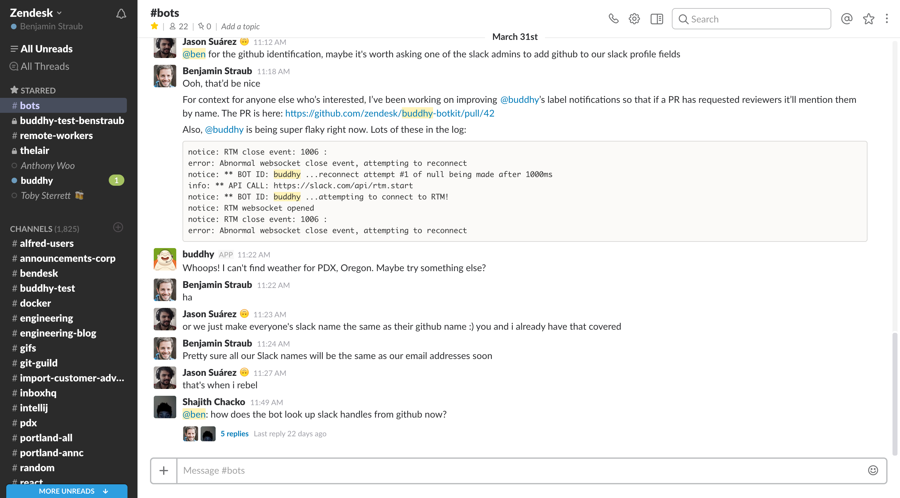

^ Now you have to figure out which of these unread notifications you need to read. You can manage this with rooms specifically for doing chatops, but you lose some of the social benefits. People start tuning it out, you lose your situational awareness.

^ So this is an empowerment tale, but also a cautionary one. It's tempting to plow ahead and blindly add this kind of thing to your team, but be mindful of the side effects, and take into account how your team will react and adapt to it.

---


^
My next story is about one of my favorite punching bags when it comes to social automation - this is how at one point Facebook told you that some of your friends have birthdays today. You got a little box so you can send them all a short message. The problem is that the box is _so_ little, and I have _so_ many friends with birthdays today, that I just copy and paste the same message in every box, or maybe I just get lazy and type HBD.

^ I even remember a time when you could just click a button and Facebook would write something for you. The affordance here isn't toward more social connection, it's towards less. You're encouraged to copy-and-paste, you're encouraged to keep your message short and generic and fast and easy to type.

---


^
Contrast this to getting an actual birthday card. Someone had to go to the store, think about which card was best for you, spend actual money on it, think of something real to write, get a hand cramp actually writing it because nobody hand writes anything any more, lick that disgusting envelope glue, spend _more_ real money for a stamp, and physically take it to a post box. And they had to do all of this literally days in advance, so it would arrive on your actual birthday.

^ This is a case where automation hurts. When birthday cards work, it's not because of the card, but because you can tell how much thought and effort was put in by the person sending it, you can tell that they care about you. Letting a machine do all of the hard work sucks all the meaning out of it.

^ But I still feel bad when I only get 3 HBD's on Facebook, and one of them is my mom.

---

[.footer: http://blog.zikes.me/post/how-i-ruined-office-productivity-with-a-slack-bot/]


^ Story #3, this one isn't mine. This is a blog post by Jason Hutchison, and his team has this funny thing they do. They take a photo of Chris, one of Jason's teammates, and paste his face into photos.

---


^ Here's Chris accepting a delicious plate of nachos from the President of the United States.

^ Jason thought it would be possible to train a robot to do this. Using a facial recognition library, he wrote a bot that would take any pasted image and try to fit Chris' face on top of the faces detected in the image.

---

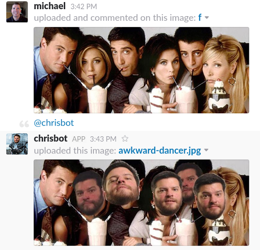

^ The result is awesome. Chrisbot isn't perfect, but Jason did a fantastic job with this, there are tons of perfect little details. Notice that the faces here are drawn in the right order, so the ones in the back remain in the back.

---


^ And if chrisbot can't find a face in the image, it will still try do something entertaining.

^ As you can imagine, the day this went live was mostly a productivity black hole. Everybody was trying it out, trying to find its weaknesses. But soon after, there was another reaction:

---


^ Chrisbot was successful in removing the drudgery of photoshopping Chris's face into photos. But it also removed the humanity, the care and taste that goes into making something funny. When a new chrisified photo comes through now, we're not laughing at the joke, we're laughing at the stupid reckless computer trying to be funny. We're laughing _at_ chrisbot, not _with_ it, and that's a totally different dynamic.

^ I reached out to Jason, and he said chrisbot is still running 3 months later, but I have a prediction about a potential downside. Chrisbot only knows how to tell one joke, and that joke won't be funny forever. My prediction is that without constant tweaking to keep the joke fresh and funny, chrisbot will dwindle until it's just a piece of nostalgia.

---

# [fit] Break:
# [fit] _**lessons**_

^ So I have a few more stories to tell you, but this is a great time to stop and take stock of what we've learned.

---

# [fit] Automating
# [fit] a thing says:

^ There's a saying in the art world that the medium is part of the message. Taken as a medium, automating things with chat robots adds some connotation to the thing you're automating.

---

# [fit] We want this thing
# [fit] _**to be done often**_

^ It says we're going to be doing this thing more than once

---

# [fit] We want this thing
# [fit] _**to be done right**_

^ It says we want to do this thing the same way every time, or following a fairly simple pattern. We don't want human error to sneak in.

---

# [fit] We want this thing
# [fit] _**to be visible**_

^ Specifically for social automation, we want more than just one person to see this thing happening

---

# [fit] We want this thing
# [fit] _**to be impersonal**_

^ And we don't care how personal it is. This one is important when the target of an automation is a person.

---


^ Another lesson I noticed as I was putting this talk together is that every one of these automations affected the culture it was inserted into. Every one has a story that goes something like "we used to do it one way, and now we do it this other way." They have changed the flow of human culture around them, like a stone in a river.

^ Another thing I noticed is that only some of the ways the river has changed were intentional. Most of how people respond to social systems are emergent, and you can only predict some of them.

^ That's actually the theme for this next part: can we be deliberate about how we're changing culture?

---

[.footer: https://18f.gsa.gov/2016/01/12/hacking-inclusion-by-customizing-a-slack-bot/]

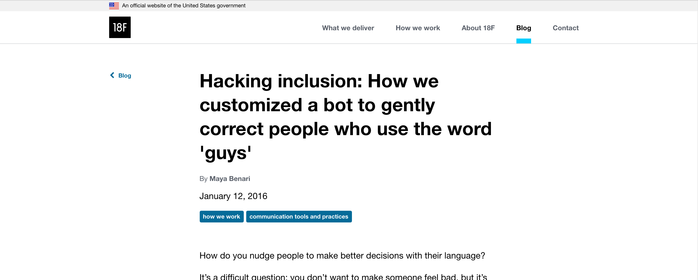

^ I work for Zendesk now, and one of my coworkers there told me about this blog post from 18f. 18F is the team inside the US government that works to modernize government web apps. The idea was to nudge people away from using the word "guys" when referring to a group that includes people that aren't men.

^ I'm not sure how it is here in the Netherlands, but in most of the US, "guys" is a term you use to refer to a group of males, as in "I'm meeting the guys for some drinks." So when you use that word when the group includes other kinds of people it doesn't really work. I haven't had this conversation with transgendered people, but the women I've talked to say it can feel like their presence isn't noticed or important, or that you think of them as "just one of the guys," neither of which feels good.

---


^ The 18f team deployed a fairly simple hack. It works using Slackbot's autoresponder, which comes in the box with Slack, it's right there in the team settings. They set Slackbot to respond immediately and publicly whenever someone says "guys".

^ I liked this idea, but I thought Slackbot sounded kind of snotty and passive-aggressive. You wouldn't be happy if a human talked to you this way, a human would be more tactful. And since we have a chat bot we wrote ourselves we get to give it some manners.

---


^ Here's what we came up with. If our Slack bot hears you use the word "guys", he'll take you aside and have a private conversation with you, and gently explain what the problem is with that word. This is what we settled on after a couple of iterations.

^ The response from this was interesting, there were a couple of major themes. I had a couple conversations with men where they'd say "well, when I use that word I mean it in a gender-neutral way," which is exactly the problem we were trying to correct, because not everyone _hears_ it that way.

^ The first couple of iterations of this did a public callout, like the 18F implementation did, and during that period I got a few people telling me how great this feature was, that it had been bugging them for a long time, but they didn't want to make a big deal of it or seem overly sensitive.

^ But the most interesting response I got was from our office in Melbourne. It turns out that in Australia, 'guys' truly is a gender-neutral term, their entire team agreed. In Australia, you can put "guys" on the door to a toilet, and everyone will use it. But as part of that discussion, certain other terms were retired from use in their office.

^ Now maybe I'm being a little silly about this, but this reaction was kind of profound for me. Again, I don't know how it is here, but in the US these days, you don't just tell someone that something they're doing is a tiny bit hurtful. They get mad, and call you names. But I wrote a tiny piece of code that _made people think about their behavior_, and have a real conversation with their teammates about a sensitive subject. That was _way_ beyond the design goals for this little chat plugin, and I'm pretty proud of it.

---

# [fit] `!shut up about guys`

^ The downside was that some people got annoyed, which is no small thing. You _want_ people to trust your automation, not think of it as the enemy. As a result, there's a command to make the robot just leave you alone. In the end I think I convinced most everyone that this is a good feature, but in order to avoid being the language police, I'd think really carefully about doing this with anything more controversial than "guys."

---


^ I also used to work at a little company called Gridium, and we had a chat bot there, too, his name was Gort. We taught him a few tricks, but probably the best one was the highfive.

^ A real-life high-five is a simple thing, it's just two people clapping. This is everything birthday cards aren't: it's not very personal, it doesn't take a lot of thought, the more spontaneous the better. Automation can't really screw this up, but it can make it way more awesome. I'm going to show you how, but first I have to set it up.

---


^ There are two characters in this scene. Greg was the chief mathematician at Gridium, and he wrote the statistical model that's at the heart of their energy-management product. Patrick was on the sales team, and in order to do his job well, he needed to understand how all the math translated into value for the customer. Greg is a fabulous teacher, and had regular sessions with the sales team to help them understand the model, so Patrick wanted to thank him. So he typed this into slack.

---


^ Gort responds by doing three things. First, he drops a gif into the channel. He has a collection of these that he draws from randomly.

^ Second, he adds a @channel mention. This ensures that all the people in that channel know a high-five has happened; even if they're not currently online, their phones will ding, or they'll get an email. Both of these, by the way, mimic the sharp sound of a real-life high-five; everyone around you knows it's happening.

^ Thirdly, and most interestingly, he uses the company credit card to order an Amazon gift card, and emails it to Greg.

^ Now obviously I didn't just think this idea up some Tuesday morning. One of the founders actually approached me, and at first I thought he was crazy, but if you're an HR nerd you'll recognize the term "peer reward program." It turns out that as an employer, the best thing you can give your employees is recognition from their peers. In terms of lasting happiness, it's even better than a big raise.

^ So Patrick could have done all of this manually, it would have taken maybe 5 minutes to put all the pieces together, but having Gort do it for him took maybe 10 seconds. A momentary impulse that makes someone feel appreciated. And the result was _better_ than a real-life high five, like after their hands met rainbow sparks exploded in the shape of an eagle, and you could hear some kick-ass guitar riff, and then Greg put his hand in his pocket and found $75.

---


^ Here's another example, this happened about two weeks before the birth of David's first child, and he was trying to land a dad joke, and it didn't quite work.

---


^ I sent this one when one of our founders discovered a bug in the high-five system, you could only send whole-dollar gift cards. I'm _pretty_ sure it sent three dollars and 14 cents, but I never did verify that.

---

# [fit] First six months
## ` `
## number of gifts _**150**_
## Average gift _**$24**_
## Average receipts _**$25**_

^ So we shipped this to the entire company, which I think was 15 people at the time, and it was immediately beloved. After the initial spike of activity, we settled into a regular usage pattern of about 3 or 4 times a week. The average gift card size was around $24, which was about what we expected.

^ So in terms of a product launch, it was a success. People liked it, and it became part of the way you work in that company. In terms of how we wanted to nudge the company culture, it was an even bigger success. People started showing gratitude to each other more often, and in a very public way. The way it was designed made everyone feel good, and not just the giver and the receiver, but bystanders too. People were more willing to go out of their way to help others. It was a very positive change.

---


^ We even saw some emergent behavior, like the habit of sharing what you were going to buy with the money. There was gentle social pressure to treat yourself, instead of just ordering more cat food. This is a really nice set of peelers someone got. I also have them, they're super nice.

---

` `
` `
## `!highfive @nick $4.23 for finding something on Amazon for exactly $4.23`

^ Of course this led to _more_ emergent behavior around that convention.

---

# [fit] Downsides

^ The biggest downside to introducing this is that some people got anxiety about choosing dollar amounts. They'd want to thank someone, but now they had to decide exactly how _much_ to thank them. Which is understandable; if someone just saved the entire company, a $5 gift card seems like a paltry reward. It helps that it's other people's money you're giving away, but putting a price on someone else's actions isn't easy.

^ Another one is the increased number of interruptions. That @channel mention is a pretty noisy thing, and it makes the same sound as when a server goes down. This was mitigated by how Slack's notifications work; you'd see that it was a high-five before switching to the Slack window, so you could ignore it if you're in the zone. The people would also self-limit on this, they'd consider the channel mention when they were deciding to high-five someone, and they'd choose an appropriate channel to do it in. It really helps that everyone at one time or another played all the roles in this system: giver, receiver,and bystander, so they had empathy for everyone involved.

---

# [fit] BX design
## [fit] _**(bystander experience)**_

^ In fact, this brings up one of the more unique things about making chat integrations: you have to consider the experience of someone who isn't using the thing itself, but sees someone else using it. What is it like to just be around when someone else is using this chat command? This can determine whether the rest of your team accepts this automation or rejects it.

---

# [fit] _**You**_ can
# [fit] do this

^ So now comes the part in my talk where I try to get you to do something. And the thing I'm going to persuade you to do is to join me in automating things socially. This isn't very hard to do, there are just three steps.

---

# [fit] _**Step 1:**_
# [fit] Get chat

^ Step 1 is to get your team into some chat software, even if you're all working from the same room.

---


^ There are lots of benefits to this, probably my favorite is that it starts making it possible to work remotely, which is becoming kind of a big deal.

---

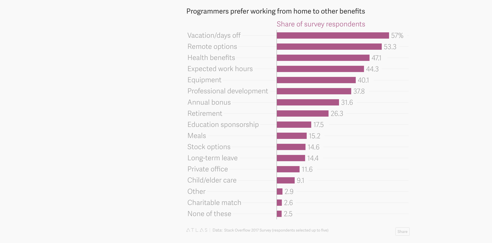

^ This is from the Stack Overflow survey earlier this year. Turns out programmers prefer remote work to almost any other perk a company can offer. The ability to go remote is #2 on this list, in between vacation benefits and healthcare coverage. (You can tell most of these respondents are in the US.)

---

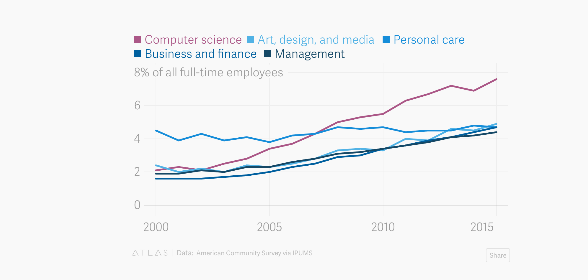

^ But it's not just programmers. Rates of people working remotely have been rising in lots of lines of work. Which is great, because everyone should benefit from cultural automation, not just engineers.

^ I could go on and on about chat. You get a searchable transcript of important discussions, you get a lot of the cross-pollination that you get in an open office, while still being able to "shut the door" by quitting the app. There's lots of good stuff here, but I'm going to assume you're already sold on the idea.

---

# [fit] _**Step 2:**_
# [fit] Get a bot

^ Step two is to add a robot to your chat. This is becoming kind of a big deal too.

---

## Contextualizing Virtual Assistants for More Effective Meetings in the Digital Workplace

## _**https://www.gartner.com/doc/3649117**_

^ This is a report from the Gartner group, and the title is kind of gibberishy, but here's their main prediction:

---

> By 2020, 60% of meetings with 3 or more participants will involve a virtual assistant.

^ Far from just being toys for nerds, bots will be a part of everyday business, and sooner than you think. So writing a bot for your company might even be a good strategic career move. Anyways, here's what you do to make one. First, choose a framework.

---

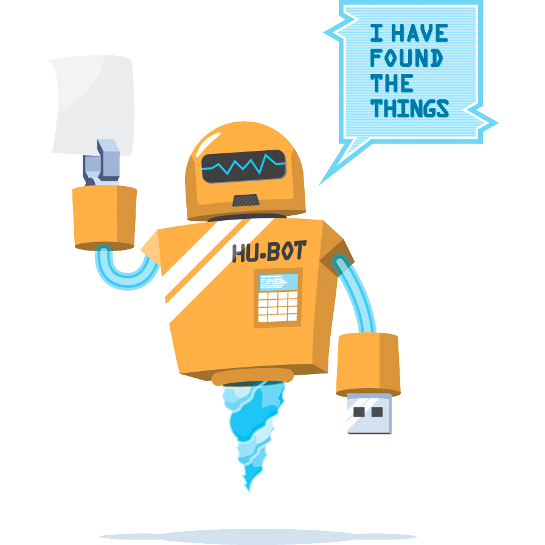

# https://hubot.github.com/

^ There are a number of these that you can just spin up and start customizing. GitHub's Hubot is open-source, and there are a ton of plugins you can just add in and configure. The plugin that runs high-five is one of them, it's open source and I've actually run into people that use it. Hubot is written in Coffeescript, and before you say anything realize that it's an artifact of its time, and you don't have to write coffeescript to use it. If you write JS all day long and want a break,

---


# http://errbot.io/

^ You can try Err, which is written in Python

---


# https://www.lita.io/

^ Or Lita, which is written in Ruby. Both of these have also been around for a while, and have a lively ecosystem of plugins, although Hubot is still the king in terms of ecosystem.

---


# https://www.botkit.ai/

^ And if you want to really dig into the internals and get more control over the UI in your chat system, I'm pretty excited about Botkit. This is especially interesting if you're wanting to use specific features of your chat software, like HipChat threading or interactive buttons in Slack, or if you want to make your bot available to more than one Slack team.

---

# [fit] _**Step 3:**_
# [fit] get hacking

^ the next step is to automate something. The easiest way to start is to turn on one of the fun built-in skills, like GIF search.

---

`> hubot animate me applause`


^ This step is actually really important, because you're starting to build trust. People need to believe that when they ask the bot to do something, it'll go and do it.

---

`> hubot animate me I got this`


^ Once people start to trust the bot with silly tasks, they'll be willing to trust it with serious work. _This_ is when the fun begins, when you can take something unique to your team and automate it.

^ Pick something easy to start with, like maybe you can ask the bot how long it's been since you released your software. It's easiest to start with just reading information out of an existing system or doing something socially fun. These bot frameworks do all the plumbing for you, so you only have to write the code that only you can write.

---

# "Ping" in Hubot

```js
robot.hear(
  /ping/i,
  (msg) => { msg.reply('PONG') }
)
```

^ For instance, here's what it looks like to do a simple call/response in Hubot. Robot.hear takes a regex, which if it matches an incoming message, it'll call the second argument, which is where you put all the meat of your plugin.

^ And yes, this is ES6. Hubot itself is written in Coffeescript, but there's nothing that says you have to write your plugins that way.

---

# "Ping" in Err

```py
from errbot import BotPlugin, botcmd

class Ping(BotPlugin):
  @botcmd
  def ping(self, msg, args):
    return "PONG"
```

^ Here's what that looks like for Err, in Python

---

# "Ping" in Lita

```rb
route(/ping/) do |response|
  response.reply 'PONG'
end
```

^ And in Ruby, for Lita.

---

# "Ping" in Botkit

```js
controller.hears(
  /ping/i,
  ['direct_message', 'direct_mention', 'mention'],
  (bot, msg) => { bot.reply(msg, 'PONG') }
)
```

^ And back to JS, this is Botkit. Botkit gives you a bit more control over what kind of contexts it'll match your regex in, so you can constrain something to just direct messages for instance, or you can watch all the messages the bot can hear, which is how we accomplished that "guys" plugin. Botkit has other great features too, like you can chain together a whole conversation with a user, asking a series of questions, without trying to manage all of the state yourself.

---

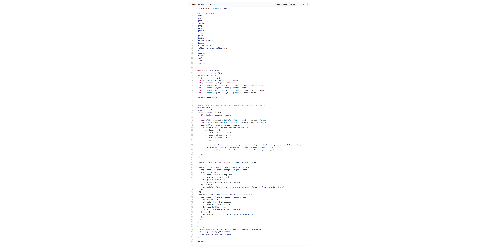

^ Of course, doing real work won't be this simple, but it's still not very hard. Here's what the "guys" plugin source looks like. about 100 lines of code, 20 of which are a list of other phrases to use besides "guys."

---


^ And here's the code for the highfive plugin, it's just over 300 lines, and 70 of them are a list of gifs. Most of the rest is gluing two other services together. Most all of the stuff you don't want to worry about is abstracted away.

---

# [fit] _**You got this**_
## [fit] 1. Chat
## [fit] 2. Automate

^ This isn't as hard as you think it is, I guarantee it. You can do this.

---

# Ben Straub

## * benstraub*


^ And when you do, I hope you'll let me know what you did and how it turned out. I'm really looking forward to hearing what kinds of things you come up with. Chatops is becoming more widespread as a thing, but it's still mostly focused on tools by engineers for engineers. I really want to encourage you to do something for regular humans, accountants, salespeople, managers. So make something awesome, and remember to tell me about it. Thanks.

---

# [fit] _**Questions?**_

## https://github.com/ben/talks/2017-robots-codemotion

# ` `

### [fit] Also: send feedback

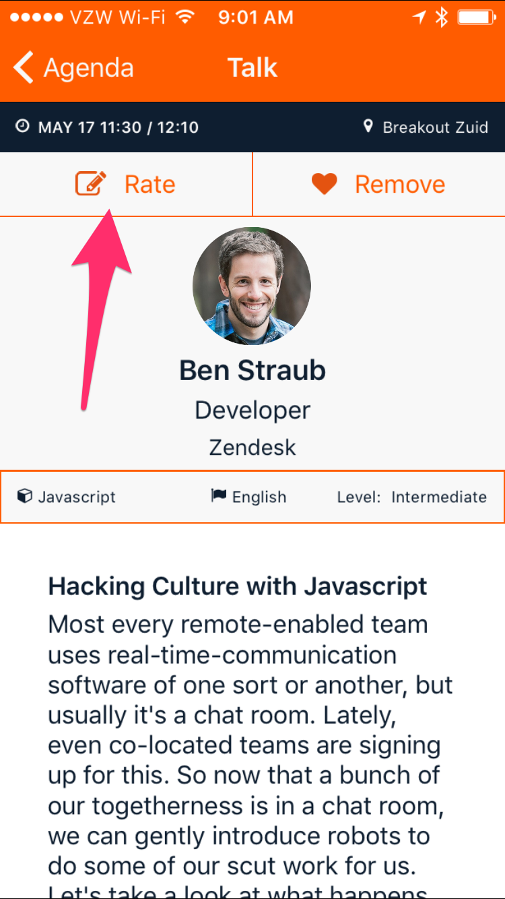
