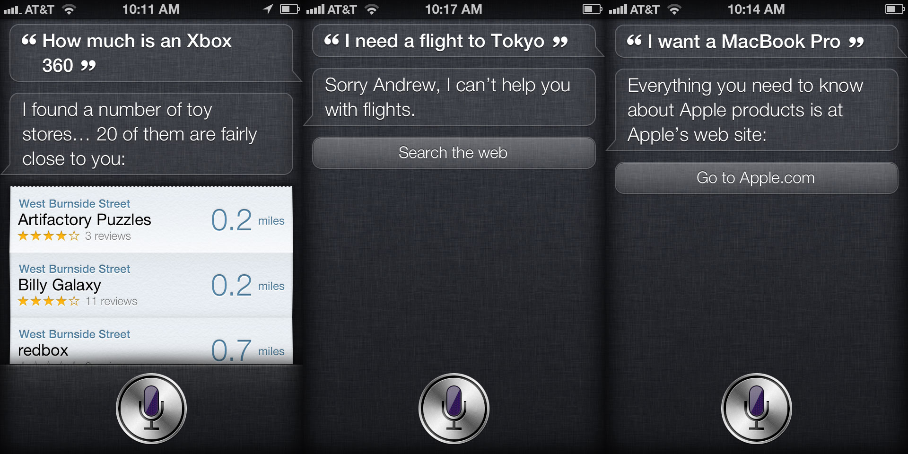
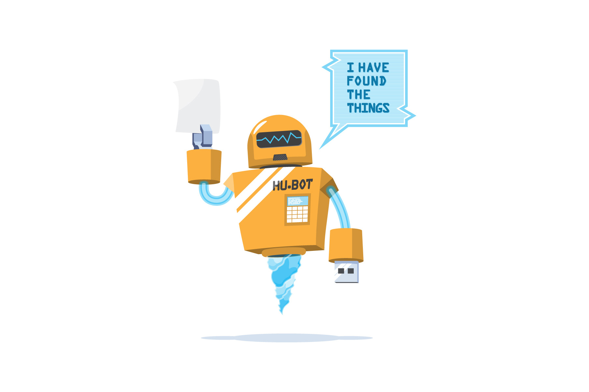
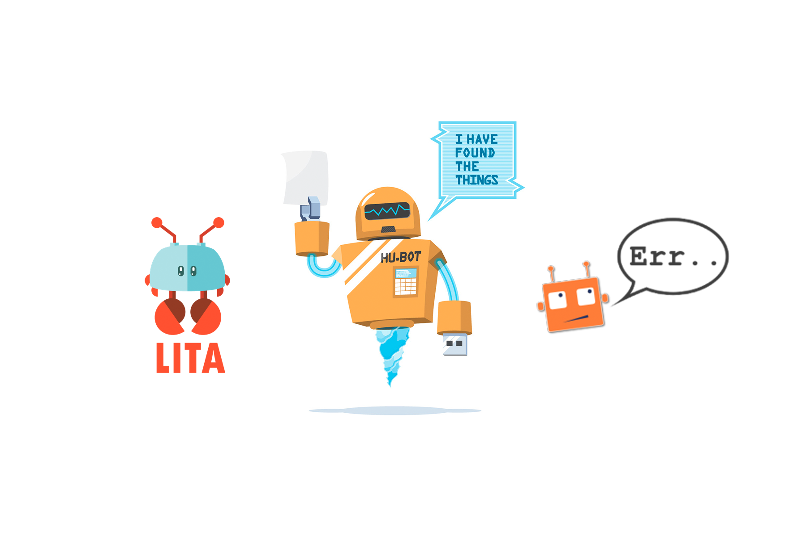
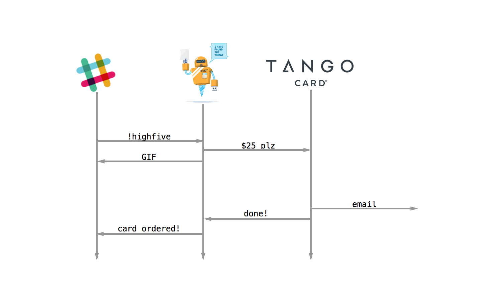

# [fit] Hacking Culture
# [fit] With Javascript

---

# Ben Straub

### * ben*

### * benstraub*

<!--  -->


---


^
i helped write a book on git

---


^
and I used to work at GH
where I learned a lot about remote teams

---


^
now I work at a company called Gridium
where I'm learning even more about remote teams
but I'm not up here to talk about any of that
right now
I'm here to talk about robots

---

# Robots

^
- everyone here wants a robot
- whether you know it or not
- robots are awesome
- never get tired or distracted
- don't care how dirty a job is
- handle things you don't want to do
- or that you might screw up
- problem: "robot", you're thinking of this

---


^
or maybe this

---


^
but the way this whole thing worked out
we didn't get those
we got this

---


^
and this

---


^
and this

---



^
so robots are here, even in our pockets
but they don't look the way we thought they would
sometimes they're pretty dumb
we're having to adjust our expectations
but let's not waste time wishing they were something else
as a wise man once said
you don't go to war with the robot army you want

---


^
you go with the one you have

---



^
This is Hubot
He's a robot that can help you make software
Not in the way you imagined as a kid
or the way you're probably imagining right now

---


^
but he's still really helpful
and he's the key to how you can change your company's culture by writing code
there is one thing you have to remember though

---

## Software is awful
## 

^
that thing is that software is terrible at making decisions

---

## Software is awful
## at making decisions

^
where it really shines is doing a boring thing lots of times
think about the way you make software
if there's a part of it that has to be done the same every single time
if there's a checklist or a script
then you're being a robot

---

## you're a terrible robot

^
and you should hire a software robot to take your place
because YOU will make mistakes, and a real robot won't

---

# [fit] culture

^
I promised I'd talk about robots and culture
humans are tricky
they're really complex
culture has lots of inputs and outputs
any kind change is going to have an effect
what kind of effect is mostly unpredictable
so unfortunately I can't do an if-this-then-that for you
what I can do is go through a thought experiment with you
so you can start figuring it out yourself

---

# get your team to use a robot

^
here's a method for onboarding a chat robot as a member of your team
I've seen this method work, both at GitHub and at two companies since then

---

# 1. Get a chat room

^
Step one is to get some chat software
Even if your team is all in the same physical room every day

---


^
have them get into a chat room
once your team starts chatting
I guarantee you'll see a behavior change within a week
you'll get less email
have fewer meetings
it's a beautiful thing
the reason this happens is because chat is preferable to email and meetings
why?

---

## easier and better

^
here's a thing to remember
any time you want to change something about the way people work together
the new way has to be both easier AND better than the old way
or it won't stick

---


^
so back to chat software
My current favorite is Slack
that's what my team uses
but you have a lot of choices
You can even set up an IRC server if you want that kind of control
the important thing is to have some kind of chat

---

# 2. Get a robot

^
Step two is to put a robot in that chat room
Here again you have several options

---



^
Err: python
Lita: ruby
Hubot: node app in Coffeescript
Hubot is great
but if you're the only JS hacker on your team
or it would be hard to deploy
then use something else
It's not terribly important which one of these you choose
as long as you have one
if you're worried about cost
all of these are free
and you can probably find free hosting
Hubot is a node app, so OpenShift is a great option right now
or piggyback on an existing service
these are all really lightweight in memory cpu and network
nobody will even notice that you're running another process on the db server

---

https://github.com/slackhq/hubot-slack

https://myteam.slack.com/services/new/hubot

^
at this point Hubot is popular enough
that most chat software has an easy way to integrate
Slack makes this especially easy
you go into Slack and tell it you want a hubot
then you configure your hubot to use the slack adapter
and give it an API key
if your chat doesn't have something like this
just set your hubot up with a regular user account
OK, now you have chat, you have a robot in your chat room

---

`> hubot ping`

`hubot: PONG`

^
Now you should be able to do this
out of the box hubot doesn't do much
he just shows up and responds to really simple stuff
like ping
most of what he can do is in plugins
which leads us to step 3

---

# 3. Turn on GIF[^1] search

[^1]: It's *JIF*, I don't care what you think

^
have some fun
turn on the plugin that lets you search for images and gifs

---

`> hubot animate me applause`


^
Seriously, this one is important.
people need to get used to asking Hubot for things
and it feels less dorky if it's fun

---

`> hubot animate me I got this`

 

^
plus, you're building trust
people won't trust a robot to do important work
if they don't trust it to do silly work

---

# 4. Automate

^
once you've built trust you can get some real work done
pick just one thing and have your chat robot do it for you
let me give you an example
who in here uses continuous integration?
anybody use some kind of good-natured public shame when the build breaks?
a mannequin that lives in the office of the last person to break the build
a dumb-looking hat they have to wear the rest of the day
it's the BEST thing
everyone gets REAL careful about running the tests before pushing
well, you can automate this kind of shame

---


^
Hubot can deliver a notif. like this
to your chat room
the second the build breaks
it's a way of gamifying CI
breaking once or twice is okay
everyone makes mistakes
but you DEF. don't want to be the person who's ALWAYS breaking the build
here's another example

---


^
this is how we deploy our software to production
the way this used to be done was to do two SSH hops to get to an ops machine
and run a deployment script
so we'd deploy maybe once a day
now that it's 14 keystrokes to run a deployment
it happens every hour or so
for some of our projects, we have this happen automatically
every time the `master` branch moves a deployment is triggered
…
ok, so now you've automated something
the magic thing about the first thing you automate
is you start seeing opportunities everywhere

---


^
it's like realizing that the world is made of code
here are some ideas for how Hubot can help you do repetitive things

---

### `> hubot address me`

^
how many times have you loaded your company's web site
just to look for the address

### `> hubot phone me`

^
or fax number?

---

```coffeescript
module.exports = (robot) ->
  robot.respond /address\s*(me)?$/i, (msg) ->
    msg.send ":office: 9565 Semiahmoo Parkway, Blaine, WA, 98230, US"

  robot.respond /(tele)?phone\s*(me)?$/i, (msg) ->
    msg.send ":phone: tel:360-318-2000"
```

^
This one is hardly any effort at all
you tell the robot to respond to a regex
by calling a function
`msg.send` just has the robot say something in the same room as the request


---

### `hubot: Card "User story #17" added to "backlog"`

^
trello integration
we use this for engineering support for onboarding new customers

---

```coffeescript
module.exports = (robot) ->
    unless trelloKey and trelloToken
        console.log "Provide HUBOT_TRELLO_KEY and HUBOT_TRELLO_TOKEN to enable Trello subscriptions"
        return
    robot.brain.data.trelloSubscriptions ?= {}
    robot.brain.data.trelloState ?= {}

    # UTILITIES
    sendToRooms = (listid, message) ->
        # Figure out which rooms get this message
        for roomid of robot.brain.data.trelloSubscriptions
            if listid in robot.brain.data.trelloSubscriptions[roomid]
                robot.messageRoom roomid, message

    isReportable = (listid, action) ->
        switch action.type
            when 'updateCard' then action.data.listAfter.id == listid
            else true

    listName = (action) ->
        if action.data.list?
            action.data.list.name
        else action.data.listAfter.name

    updateStateForList = (listid) ->
        new TrelloApp(robot).fetchAddActionsForList listid, (actions) ->
            for a in actions when isReportable(listid, a)
                unless robot.brain.data.trelloState[a.id]?
                    sendToRooms listid, "Trello card '#{a.data.card.name}' added to '#{listName a}'\n" +
                        ":point_right: https://trello.com/c/#{a.data.card.shortLink}"
                    robot.brain.data.trelloState[a.id] = true

    updateState = ->
        # Get a set of lists to query
        listids = {}
        for roomid of robot.brain.data.trelloSubscriptions
            for listid in robot.brain.data.trelloSubscriptions[roomid]
                listids[listid] = true

        for listid of listids
            updateStateForList listid


    # Check status every 30 seconds
    setInterval updateState, 30*1000
    updateState()
```

^
This one takes a bit more code to accomplish
but the principles are the same
respond to a regex-matched command
do what you need to do
and send a reply to the chat room
I'd love to walk you through all of the details
but this talk is only 25 minutes
so we'll skip the code from here on out

---

### `> hubot where is @elizabeth`

^
colleague that's always traveling to interesting places
hit the foursquare API
show where Elizabeth last checked in
this is NOT creepy btw
a - Elizabeth's 4sq checkins are public
b - you okayed it with her before ever doing this

---

### [fit] `> hubot package 1Zfjkld9032`

^
if you commonly send or receive packages
have Hubot drop a map image in the room

---

### [fit]`> hubot rf run integration`

^
service called rainforest
like mechanical turk for manual testing

---

### [fit] `> hubot provision 1 front-end`

^
if you use Amazon EC2 instances
you could spin up a new machine
and add it to a load balancer

---

### `> hubot tweets burger near Blaine`

^
maybe you're wondering where to go for lunch
you could see who's talking about burgers nearby

---

### `hubot: @channel response time is 24367ms 😱`

^
Hubot could notify your team when your site loses responsiveness
this is an early-warning signal that your site is down completely
hubot could ping
or integrate with Pingdom

---

### `> hubot htop fe-6`

^
you could fetch some machine statistics

---

### [fit] `> hubot graph -2d @app.version`

^
if you gather metrics using graphite or datadog
have Hubot put graphs in your chat room
this one is especially powerful
changes conversation from "I think we should"
to "look at this graph, here's what we need to do"

---

### `> hubot tweet We just shipped something great!`

^
give Hubot write access to your company's twitter account
now you don't have to worry about who's got the password


---

## But what about...?

^
And now you're thinking
"this will never work at my company because..."
they'll never let me, or
we don't want just anyone writing tweets
but the great thing is you're in control
do something they _will_ let you
limit tweeting to a whitelist

---

- Address and phone number
- Trello notifications
- Foursquare location
- Package tracking
- Rainforest test runs
- AWS EC2 instance management
- Twitter search
- …

^
each one of these is maybe an hour of work
and each one is a cultural stimulus
with a different response
automating a thing sends a signal about that thing
for notifications…

---

### we always want to know
### about this thing

^
information that is delivered or that you subscribe to
You're probably thinking "I already have tools for a lot of this stuff"
and you're right
but you have to go to them
putting them in a chat room means they come to you
even when someone else is looking at them
for actions…


---

### This thing should be
### easy and correct

^
something you ask the robot to do
you want this thing to be really easy to invoke
and you want it done the same way every time
above all…

---

### This thing should be
### Highly visible

^
you want everybody who's watching to know about this thing
or at least be able to know about this thing

---


^
it's like putting something up on the main screen
you're telling everyone "hey, look at this"
or "hey, this thing happened"

^
everything I've been describing up until now has an umbrella term:

---

# [fit] This is
# [fit] Chat Ops

^
Chat Ops
There are lots of benefits to doing things this way
my favorite is that your team is now almost ready to be remote
but even if that's not the direction you want to go
there's still good stuff here
for instance.
this is AMAZING for onboarding a new engineer
think about it: it's like pairing with everyone on ops all the time
your chat room is a shared command line terminal
and every team member can watch the most experienced person work
they see the right way to do things
every day
including their first day

---

## Nerds only?

^
So this is all really good for us in this room
but we're mostly engineers and designers
what about hr/sales/support?
can the rest of the company benefit from this too?
you know what, let's talk about companies

---

# Companies are all different

^
Just as every engineering team is different
every company is a unique and beautiful snowflake too

---

# Companies are all the same

^
And just like all engineering teams do a few of the same things
all companies do too
like management and hiring and benefits
Hubot's seen a lot of use with technical operations tasks
but this is sort of new territory

---


^
he's not built for this squishy human stuff
in fact, he can do worse than a bad job

---

# Automating an action says

- We want this thing to be easy
- We want this thing to be correct

^
Remember this list of what automating an action says?
Yeah, there's another one:

---

# Automating an action says

- We want this thing to be easy
- We want this thing to be correct
- *We don't care how personal it is*

^
here's a great example: FB birthday reminders

---


^
When I get an "HBD" from a FB friend, I think
"okay, you cared enough to fill in the box when Facebook told you to."
Contrast this to getting an actual birthday card

---


^
Someone went to the store, picked a card out, hand wrote a message
spent real money to send it to you
plus, they did all this two days in advance
perhaps not what FB intended
nobody sends real cards anymore
rarity makes it more meaningful
humans value effort and care and personalization
robots just aren't good at these things

---

-Danboard--1574498-3660x2369.jpg)

^
So what kind of judo move can we pull here?
how do we automate something human and not kill the meaning of the gesture?
What's something we want to make easy
but won't be reduced to meaninglessness by the fact that it IS easy?

---


^
what about a high-five?
I'm about to describe something that when our founder proposed it
I thought he was a bit nuts
but it's actually brilliant
Let me show you how this works in practice, then I'll tell you how it's changed our company's culture

---


^
a little background first
greg is our chief mathematician
and wrote the statistical model that's at the core of our product
in order for the sales team to do their job well
they need to understand what the math will do for the customer
and greg is a fabulous teacher
patrick is on our sales team
and wanted to thank greg for doing such a great job
so he types this into slack

---


^
and here's what happens
there are a few interesting things about this
1 - GIF (collection)
2 - @channel
3 - AMZN card, company CC

^
patrick could have done all this manually
but it would have taken him 10 minutes
this took him ten seconds
he didn't even have to ask permission
Anybody in the company can do this
not just managers
not just engineers
any person
can send anyone a gift card at the company's expense
for any reason

---


^
Here's another one
typical of how engineering rewards each other

---


^
This one happened when Tom discovered that only whole-dollar awards would work
Pretty sure it sent 3 dollars and 14 cents

---

## Don't worry

^
you're probably wondering when we'll go out of business because of this
there ARE some basic limits
can't highfive yourself
per-gift limit, daily limit
but perhaps surprisingly they haven't come into play

---

## Gambling

^
Also, just to make it more fun
we added a couple of tricks that would make Vegas proud
Some random percentage of the time
one of two things will happen
daily double
boomerang
each with their own set of GIFs
we just added these two weeks ago
don't know long-term effects yet
but they're pretty fun

---

# How it works

^
here's how highfive works
it's simpler than it seems

---



^
hubot sees the command and parses out the parts of it
dollar amount, reason, etc.
kicks off a request to a svc called Tango Card
this is a company that has a REST API for buying gift cards
they have lots of kinds, but we chose Amazon, easiest to spend
While that's happening
Hubot pulls a GIF from his library and makes noise in the chat room
Tango card sends the user an email with the gift code
Hubot gets a confirmation and posts results to the chat room

---

# Benefits

^
so we automated giving out gift cards
and remember: automating a thing has side effects
we've seen some cultural benefits from this

---

## :moneybag::moneybag::moneybag:

^
most obvious input is the money
you'd think that people would either be really reluctant to spend real money
or go completely overboard when it's not their OWN money
but we've actually seen really reasonable behavior

---

- 150 gifts in first six months
- Average givings: $24/gift
- Average receivings: $25/mo

^
these numbers are about what you'd want to spend on any reward program
but they emerged organically
after a very short time people started to have an expectation for a "normal" award

---


^
another emergent behavior:
the tradition of sharing what you bought with the money
someone got some really nice peelers once

---

```
!highfive @nick $4.23 for finding something
                on Amazon for exactly $4.23
```

^
which then results in people giving out interesting amounts for high-fives

^
these things are designed to be fun
so people give them out all the time
we're finding that…

---

## Recognition

^
we recognize our coworkers for their achievements more often
any HR pro will tell you people respond more to recognition than to money
especially when it comes from their peers
plus it's less work for management:
the burden of deciding who the awards should go to is shared
across the whole team

---

## Incentives

^
We've also noticed that nobody's trying to abuse the system
because we all want the right things
I as an individual want to make sure everyone else is rewarded
because I'll be seen as generous
AND I want to do noticeably nice things for others
to make sure I get rewarded for being helpful
incentives aligned perfectly

---

## imaginificence(?)

^
There's one more benefit I've seen, but it's kind of subtle
The classic chat ops path is fairly obvious to engineers
you use software to automate software
but these squishy HR things are kind of new territory
building this thing had the effect of making our engineers think about HR and feelings
and letting them know that their skills aren't just for making product
they can also use them to make the company a better place to work

---

# everyone's job

^
because that's everyone's job
don't depend on HR or management
for a great workplace or culture
culture is you
and it's me
and it's the way you we work together
so after this conference
when you've slept off all the endorphins
and you go to work on Monday
here's what I want you to do

---

## Go do this right now
### Get a chat
### Get a robot
### Automate all the things

^
get some chat software
put a robot in it
and start automating things
make your company a better place by writing code
and then tweet me and let me know how it turns out

---

# Chat Robots
## Ben Straub

###  *@benstraub*

<!--  -->


