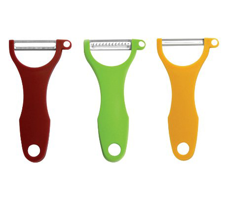

# [fit] Hacking
# [fit] Culture
# [fit] _**With Javascript**_

^ Hello

---

# Ben Straub

## * ben*

## * benstraub*

^ My name is Ben Straub. I'm 'ben' on GitHub and 'benstraub' pretty much everywhere else.

---

# TODO: images of Wacom and GHfW

^ I've worked on a lot of things in my career, from device drivers to desktop applications to a book on git

---

---

# [fit] automation

^ today I want to talk to all of you about automation

---

# [fit] cultural
# [fit] automation

^ Specifically cultural automation, which I think is a term I made up as I was writing this talk. What I mean by "cultural automation" is the use of machines to assist with social interactions. We've all done this.

---

^ I'm assuming everyone in this room has at some point used an image or an emoji instead of some words in an otherwise textual medium. This is what I mean by _cultural automation:_ not only do the tools give you a way of sending something that was hard to do before, but they do it in a way that affords adding human meaning to the message.

^ I've known people who are _really_ good at this. One person I know took some time off between jobs, and when he was asked in a chat room what he did with himself during his months-long absence, he replied only with a photo like this.

---

[^≈]

[^≈]: https://www.flickr.com/photos/jackal1/15066929313

^ No words, just a simple image, and yet it tells a larger story than he could have fit into 20 minutes of typing into a text field.

^ It seems obvious to us now that communicating with photos and clipart is a good thing, though it was hardly obvious back when text messaging was new, and adding a camera to a cell phone seemed like a really stupid idea at the time.

---

# [fit] Automation
# [fit] Is _**good**_

^ Now, as engineers and developers, we usually take it for granted that automation is a good thing. It lets us move faster than we otherwise would be able to, and make fewer mistakes. That certainty has, with a few exceptions, borne out, and the world is a much different place now than it was 10 years ago because of automation.

---

# [fit] Automation
# [fit] is _**Dumb**_

^ But we also need to keep in mind that computers don't think, at least not like us.

---

> A computer lets you make more mistakes faster than any invention in human history
-- Mitch Ratcliffe

^ They only do what we tell them to, in the most pedantic way possible. We've learned from 50 years of writing computer programs and a couple thousand years of making machines that we have to be careful where we point these things.

---

# [fit] Cultural
# [fit] Automation
# [fit] Is good_**?**_

^ So when we talk about automating culture, we need to make sure we're paying attention to the outcomes, and learn lessons from our mistakes. I have a few examples to show you.

---

^ I used to work at GitHub, and I learned a lot about how to be on a remote team. Some of the most memorable lessons from that company are how to do social workflows as part of software development.

---

^ I should mention that automation at GitHub is given a personality. Hubot is the name of the robot who lives in the chat room, and who is the conduit for all the things you can do from the chat room.

---

^ One example is deployment. GitHub deploys to production upwards of 200 times every week, and pretty much the only UI for deploying is the chat room - you just tell Hubot to go do a deploy.

^ This has a number of benefits. Obviously, it's easy to see when someone is doing a deploy, but dig a little deeper and you see all sorts of social niceties with this. Everyone on the team sees all of the deploys happen. When a deploy goes badly, you don't need to go alert the team, they can see it happening right in front of them.

^ Maybe most subtly, this helps a lot with onboarding. Imagine it's your first day on the job, and you've made a small change to the website, and you want to push it out to the world. You probably have someone sitting next to you (whether literally or figuratively) helping you figure this out, but by the end of that day you've probably seen 10 of the other engineers do it, along with all the stuff you do before and after a deploy. This gets you a lot of the benefits of pairing up, all of the time.

---

^ Another great example is metrics. Gathering metrics and displaying graphs and dashboards is probably something we've all done, but doing it in a chat room adds a social aspect to it.

^ When you put up a graph in the chat room, you're saying to the rest of the team "everybody look at this, there's something important I want you to see." It's less like digging through metrics, and more like putting something on the big screen at the front of mission control.

---

^ Again, this has the benefit that everybody can see what the most experienced engineer on the team is doing. What kinds of metrics do they pay attention to? How does that person go about finding a problem?

---

# [fit] Chat_**Ops**_

^ Jesse Newland coined the term ChatOps to describe this stuff. I've talked about the benefits, but there are drawbacks as well. The most obvious one is noise. When your whole product team is 5 or maybe 10 people, the amount of content scrolling by in the chat room is manageable, but with a team of 50 it's almost unbearable. You're probably deploying and monitoring 10 projects independently, so you move some of them into separate rooms, and pretty soon your Slack looks like this.

---

^ Then you have the problem of figuring out which of these unread notifications you need to read. You can manage this with rooms specifically for doing chatops, but you lose some of the social benefits. People start tuning it out, and you lose your situational awareness.

---

^
Here's on of my favorite punching bags when it comes to social automation. When I get an "HBD" from a FB friend, I think "okay, you cared enough to fill in the box when Facebook told you to." I remember a time when you could just click a button and Facebook would write the HBD for you.

---

^
Contrast this to getting an actual birthday card. Someone had to go to the store, think about which card was best, spend real money on it, write something real in it, lick that disgusting envelope glue, spend _more_ real money for a stamp, and physically take it to a post box. And they had to do all of this in advance so it would arrive on your actual birthday.

---

^ Or maybe they actually made it for you, and hand delivered it! How cool is that?

^ So this is a case where automation hurts. When birthday cards work, it's because they're really just a representation for the thoughtfulness and care of the person doing the giving. Letting a machine do all of that sucks all the meaning out of it.

^ But it still hurts my feelings when I only get 3 HBD's on Facebook.

---

## [fit] http://blog.zikes.me/post/how-i-ruined-office-productivity-with-a-slack-bot/

^ Here's another example, this one isn't mine. This is a blog post by Jason Hutchison, and his team has this funny habit of pasting one of their members' faces into famous photos.

---

^ Here's Chris meeting with the President of the United States.

^ Jason decided that it was possible to train a robot to do this. Using a facial recognition library, he wrote a bot that would take any pasted image and try to fit Chris' face onto the faces detected in the image. He named it chrisbot.

---

^ This bot has tons of nice touches; you'll notice that the faces are drawn in the right order, so the ones in the back remain in the back.

---

^ This is also a nice touch: if a face isn't detected in the image, chrisbot will still do something entertaining.

^ As you can imagine, the day Jason introduced this bot was mostly swallowed by people trying it out, trying to find its weaknesses. Jason doesn't go into what's happened since then, but I have some predictions.

---

^ Chrisbot successfully removed the drudgery of photoshopping Chris's face into photos. But it also removed the humanity, the care and taste that goes into making something funny. When a new chrisified photo comes through now, we're not laughing at the cleverness of the person doing the photoshopping, we're laughing at the recklessness of computers as they try to be funny. We're not just laughing _with_ chrisbot, we're laughing _at_ chrisbot.

---

# [fit] effects

^ Every one of these tools has a before and after story. The fact that they exist means they have changed the human culture around them, like a stone in a river. Some of the ways the river changes are intentional, but most are not, they're emergent.

^ Can we be deliberate about how we're changing culture? It's usually impossible to predict the **exact** response you'll get from a particular tool, but you can sometimes figure out the initial response.

---

# [fit] https://18f.gsa.gov/2016/01/12/hacking-inclusion-by-customizing-a-slack-bot/

^ One of my coworkers at Zendesk pointed me at this blog post from 18f, which is the team inside the US government that works to modernize government web apps. The idea was to nudge people away from using the word "guys" when referring to a group that includes women.

^ So i'm not sure how it is here in the Netherlands, but in the US, "guys" is a term you use to refer to a group of males, as in "I'm meeting the guys for some drinks." So when you use that word when the group includes women, it can feel like their presence isn't noticed, or that you think of them as "just one of the guys," neither of which feels good.

---

^ The 18f team used a fairly simple hack. It works using Slackbot's autoresponder, which you can configure in the team settings. They set Slackbot to respond immediately and publicly whenever someone uses that word.

^ I liked the idea, but I thought Slackbot sounded kind of snotty and passive-aggressive. You wouldn't be happy if a human talked to you this way, a human would be more tactful. And since we have a chat bot we wrote ourselves we get more control over how it behaves.

---

^ Here's what we came up with. Our Slack bot will take you aside and have a private conversation with you, and gently explain what the problem is with that word. There's even a way to tell the robot to shut the hell up about it.

^ The response from this was interesting. There were a couple of major themes. I had a few conversations with men where they'd say "well, when I use that word I mean it in a gender-neutral way," which is exactly the behavior we were trying to nudge away from, because not everyone _hears_ it that way.

^ But the most interesting response I got was from our office in Australia. I mentioned before that the semantics of the word "guys" is dependent on culture. It turns out that in Australia, 'guys' truly is a gender-neutral term, their whole team agreed. But as part of that discussion, certain other terms were retired from use in their office. They actually had a conversation, as a team, about making sure they didn't inadvertently hurt each other with casual language. This was _way_ beyond the design goals for this little plugin, and I was super thrilled when they told me.

^ I also used to work at a company called Gridium, and we had a Hubot there, too. We taught him a few tricks, but probably the best one was the highfive.

---

^ A real-life high-five is a simple thing, in human terms. It's just two people clapping cooperatively. There isn't a lot of thought that goes into it, just a momentary impulse. Automation can't really screw this up, but it can make it way more awesome. This is easiest to describe with an example.

---

^ Greg was the chief mathematician, and he wrote the model that's at the heart of their energy-management product. Patrick was on the sales team, and in order to do his job well, he needed to understand how all the math translated into value for the customer. Greg was a fabulous teacher, and had regular sessions with the sales team teaching them how to think about the model, so Patrick wanted to thank him. So he typed this into slack.

---

^ Gridium's hubot instance (whose name is gort) leaps into action, and does three interesting things. First, he drops a gif into the channel. He has a collection of these that he draws from randomly.

^ Second, he mentions @channel. This ensures that all the people in that channel know a high-five has happened. This mimics the sharp sound of a real-life high-five.

^ Thirdly, and most interestingly, he uses the company credit card to order an Amazon gift card, and emails the redemption code to Greg.

^ Now Patrick could have done all of that manually, and it would have taken maybe 5 minutes, but having Gort do it for him took all of 10 seconds. A momentary impulse that makes someone feel appreciated. It's like they just slapped hands, but rainbow sparks exploded from the place where their palms met, and heavenly music played, and then Greg found $75 in his back pocket.

---

^ Here's another example, this happened about two weeks before the birth of David's first child, and he tried to land a dad joke, and it didn't quite work.

---

^ I sent this one when one of our founders discovered that you could only send whole-dollar gift cards using the high-five system. I'm _pretty_ sure it sent three dollars and 14 cents.

---

# [fit] First six months
## ` `
## 150 gifts
## Average gift $24
## Average receipts $25

^ So we shipped this to the entire company, which I think was 15 people at the time, and it was immediately beloved. There was a spike of activity due to the novelty, after which it seemed like 3 or 4 times a week was pretty common. I think the average gift card size was around $24, which seemed about right.

^ So in terms of a product launch, it was a success. In terms of how we wanted to nudge the company culture, it was an even bigger success. People started thanking each other more, in a very public way. The way it was designed made both the giver and receiver feel pretty good, so people were happier to go out of their way to help others. It was a very positive change.

---

^ We even saw some emergent behavior, like the habit of sharing what you were going to buy with the money you just got. This is a really nice set of peelers someone got. There was gentle social pressure to treat yourself, rather than order more cat food.

---

# [fit] Downsides

^ Culturally there weren't a lot of downsides. The one that I can think of is that some people got anxiety about choosing dollar amounts. They'd want to thank someone, but now they had to decide exactly how _much_ to thank them.

^ Another one, and there's no real way to quantify this, is the increased number of interruptions. This seemed to be self-limiting, though; people would consider the channel mention when they were deciding to high-five someone, and they'd choose an appropriate channel to do it in.

---

# [fit] _**You**_ can do
# [fit] this too

---

# TODO: Hubot

---

# TODO: Botkit
