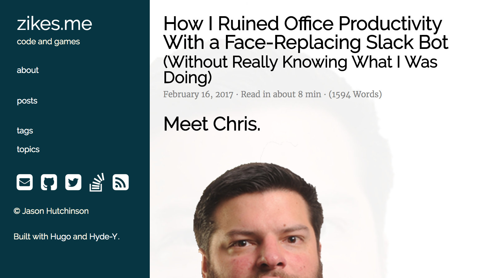

# [fit] Hacking
# [fit] Culture
# [fit] _**With Javascript**_

^ Hello

---

# Ben Straub

## * ben*

## * benstraub*

^ My name is Ben Straub. I'm 'ben' on GitHub and 'benstraub' pretty much everywhere else.

---

^
i helped write a book on git

---

# [fit] automation

^ today I want to talk to all of you about automation

---

# [fit] cultural
# [fit] automation

^ Specifically cultural automation, which I think is a term I made up as I was writing this talk. What I mean by "cultural automation" is the use of machines to execute social interactions, autonomously or otherwise.

^ Using computers to help you interact with other humans

---

# TODO: texting with images

---

# [fit] Automation
# [fit] Is _**good**_

^ As engineers and developers, we usually take it for granted that automation is a good thing. It lets us move faster than we otherwise would be able to.

---

# [fit] Automation
# [fit] is _**Stupid**_

^ We also need to keep in mind that automation can't think, it can only do.

---

> A computer lets you make more mistakes faster than any invention in human history
-- Mitch Ratcliffe

---

# [fit] Cultural
# [fit] Automation
# [fit] Is good_**?**_

^

---

# TODO: GitHub

^ I used to work at GitHub, and I learned a lot about how to be on a remote team. Some of the most memorable lessons from that company are how to do social workflows as part of software development.

---

# TODO: Facebook Birthdays

^
When I get an "HBD" from a FB friend, I think "okay, you cared enough to fill in the box when Facebook told you to."

^
Contrast this to getting an actual birthday card. Someone had to go to the store, think about which card was best, spend real money on it, write something real in it, lick that disgusting envelope glue, spend _more_ real money for a stamp, and physically take it to a post box. And they had to do all of this in advance so it would arrive on your actual birthday.

---

---

---

# [fit] effects

^ Every one of these tools has a before and after story. The fact that they exist means they have changed culture around them, like a large stone in a river.

^ Knowing this, can we be deliberate about how we're changing culture? It's usually impossible to predict the **exact** response you'll get from a particular automation, you can sometimes figure out the first response.

---

> How we customized a bot to gently correct people who use the word 'guys'
-- Maya Benari, 18f.gsa.gov

^ Here's an experiment we tried at Zendesk. Another engineer pointed me at this blog post from 18f, which is the team inside the US government that works to modernize government web apps. The idea is to nudge people away from using the word "guys" when referring to a group that includes women.

^ So i'm not sure how it is here in the Netherlands, but in the US, "guys" is a term you use to refer to a group of males. "I'm meeting the guys for some drinks," "it's guys' night in," that sort of thing. So when you use that word when the group includes women, it can feel like their presence isn't noticed, or that you think of them as "just one of the guys," neither of which feels good.

---

^ It works by having Slackbot respond immediately and publicly whenever someone uses that word, which you can configure in Slack's own team settings.

^ I liked the idea, but I decided Slackbot sounded kind of passive-aggressive. You wouldn't be happy if a human talked to you this way, a human would be more tactful. And since we have a chat bot we wrote ourselves we get more control over how it behaves.

---

# TODO: video of 'guys' response

^ Here's what we came up with. Our Slack bot will take you aside and have a private conversation with you, and gently explain what the problem is with that word. There's even a way to tell the robot to shut the hell up about it.

^ The response from this was interesting. There were a couple of major themes. I had a few conversations with men where they'd say "well, when I use that word I mean it in a gender-neutral way," which is exactly the behavior we were trying to nudge away from, because not everyone _hears_ it that way.

^ But the most interesting response I got was from our office in Australia. I mentioned before that the semantics of the word "guys" is dependent on culture. It turns out that in Australia, 'guys' truly is a gender-neutral term, their whole team agreed. But as part of that discussion, certain other terms were retired from use in their office. They actually had a conversation, as a team, about making sure they didn't inadvertently hurt each other with casual language. This was _way_ beyond the design goals for this little plugin, and I was super thrilled when they told me.

---

# TODO: Highfive

^ I also used to work at a company called Gridium, and we had a Hubot there, too.

^ We taught him a few tricks, but probably the best one was the highfive.
